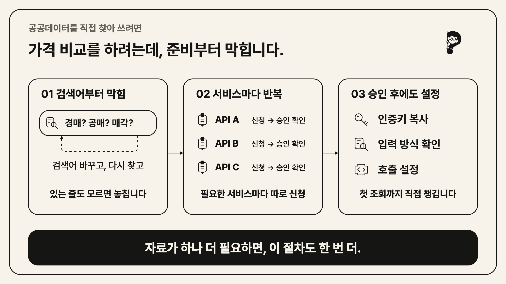
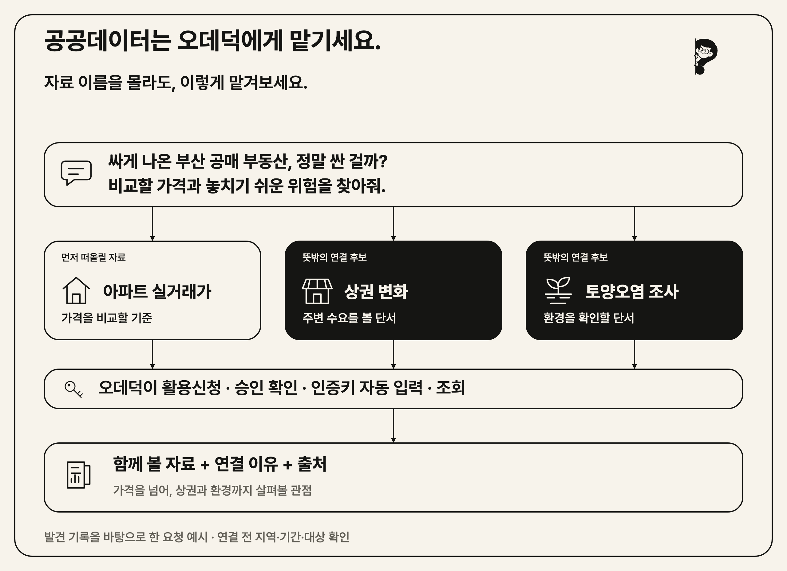
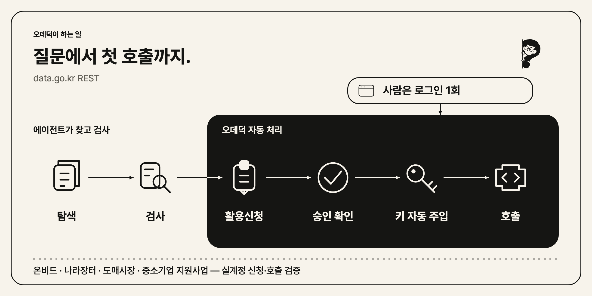
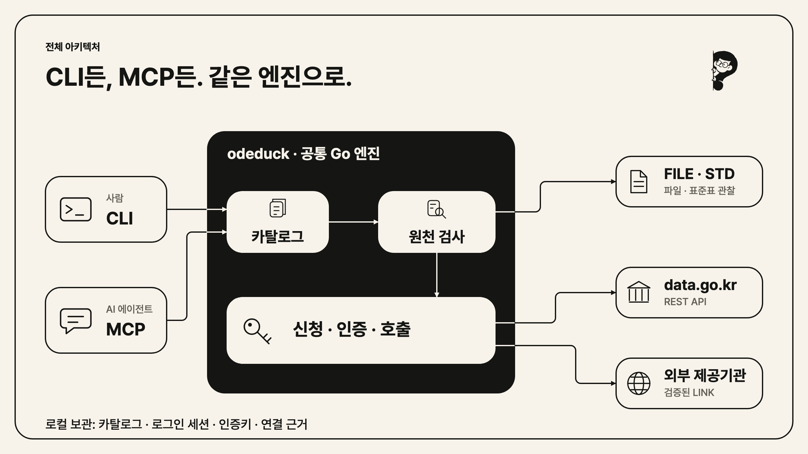
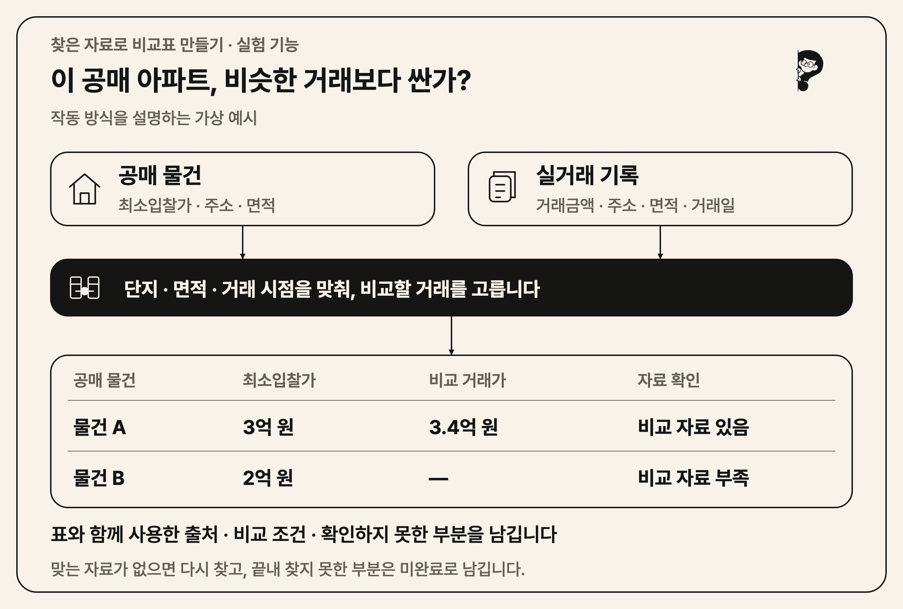

<!-- brand:start -->
<p align="center">
  
</p>

<h1 align="center">오데덕</h1>

<p align="center"><em>오픈데이터 덕후, 오데덕.</em></p>
<p align="center">공공데이터는 오데덕에게 맡기세요. 찾고, 신청하고, 가져옵니다.</p>
<!-- brand:end -->

<!-- Keep the introduction animation visible. Core capabilities and architecture must also remain visible, not collapsed. -->
<p align="center">
  <a href="docs/assets/odeduck-hero.mp4"></a>
</p>
<p align="center">
  <sub>서로 상관없어 보이는 조각도, 함께 보면 질문의 나머지가 된다. · <a href="docs/assets/odeduck-hero.mp4">원본 영상</a></sub>
</p>

<p align="center">
  
  <a href="LICENSE"></a>
</p>

<p align="center">
  <strong>공공데이터 96,000+개 &middot; 활용신청부터 데이터 조회까지</strong><br>
  <sub>data.go.kr의 API·파일·외부 제공기관 자료를 함께 찾아봅니다.</sub>
</p>

---

## 데이터를 쓰기 전부터 막히는 이유

**싸게 나온 공매 물건을 주변 거래와 비교하고 싶을 뿐인데.**
무슨 검색어를 넣을지 고민하고, 자료를 하나씩 열어보고, 서비스마다 신청과 승인 확인을 반복합니다.
승인이 나도 인증키와 호출 설정을 챙겨야 합니다. 정작 가격 비교는 시작도 못 했습니다.



게다가 **있는 줄도 모르는 자료는 검색할 생각조차 못 합니다.** 가격만 찾다가 주변 상권이나 환경을 확인할 자료를 놓칠 수 있습니다.

**찾고, 신청하고, 가져오는 일은 오데덕에게 맡기세요.**
Codex·Claude·Gemini·Cursor에 연결하면, 오데덕이 필요한 자료와 함께 미처 생각하지 못한 자료도 찾아봅니다.

[맡기는 예시](#이렇게-오데덕에게-맡겨보세요) · [빠른 시작](#빠른-시작) · [신청·조회](#활용신청과-데이터-조회) · [전체 구조](#전체-아키텍처)

## 이렇게 오데덕에게 맡겨보세요



실제 공매 탐색에서는 **실거래가와 함께 부산 상권 변화·토양오염 조사**가 후보로 나왔습니다.
가격을 비교할 자료에 주변 수요와 환경을 살펴볼 단서가 더해진 셈입니다.
이름이 비슷한 자료를 모으는 데서 그치지 않고, 같은 질문에 도움이 될 다른 관점을 찾습니다.

로그인과 AI 연결을 마쳤다면 이렇게 요청할 수 있습니다.

> 싸게 나온 부산 공매 부동산을 보고 있어. 비교할 가격과 놓치기 쉬운 위험을 찾아줘. 필요한 API는 신청·조회해서 함께 볼 자료와 확인할 점을 정리해줘.

한 요청에서 필요한 서비스를 각각 확인하고, 미신청 API는 신청한 뒤 승인된 데이터를 조회하는 흐름입니다.
실제 비교에는 물건 종류·지역·기간이 맞아야 합니다. 토양 조사 기록만으로 특정 물건의 오염 여부를 단정할 수는 없습니다.
[실제 발견 기록과 예시에 쓴 데이터](docs/research/connection-discovery-evaluation.md#readme-연결-예시--2026-09-12)

## 이런 일에 써보세요

돈을 쓰거나 벌기 전에 확인할 자료, 오데덕에게 찾아달라고 해보세요.

| 이렇게 물어보세요 | 함께 찾아볼 자료 |
| --- | --- |
| “카페를 열 자리를 고르고 있어. 손님이 올 만한 곳인지 확인할 자료를 찾아줘.” | 생활인구, 업종별 매출, 주변 점포 |
| “우리 회사가 신청할 만한 지원사업을 찾아줘.” | 지원사업 공고, 신청 자격, 접수 기간 |
| “식당 재료비를 줄이고 싶어. 최근 도매가격과 반입량을 볼 자료를 찾아줘.” | 품목별 도매가격, 반입량, 거래 지역 |

오데덕은 약 9.6만 건의 데이터 목록에서 후보를 찾고, 실제로 어떤 항목을 제공하는지 확인합니다.
검색 결과에는 자료의 출처가 함께 나옵니다. 찾은 자료를 맞춰 비교표를 만드는 기능은 [실험 단계](#찾은-자료로-비교표-만들기--실험-기능)입니다.

## 탐색부터 신청·호출까지



데이터를 찾은 뒤 매번 포털에 들어가 신청하고 인증키를 복사할 필요가 없습니다.
**data.go.kr에 한 번 로그인하면, AI가 필요한 활용신청 → 승인 확인 → 인증키 입력 → 데이터 조회를 이어갑니다.**
사용하는 AI 앱의 실행 승인 설정에 따라 제출 전에 확인을 요청할 수 있습니다.
기관의 심의가 필요한 데이터는 승인을 기다려야 합니다.

온비드·나라장터·공영도매시장·중소기업 지원사업 데이터는 실제 계정으로 신청과 조회까지 확인했습니다.
[확인한 범위](docs/validation-summary.md)

## 빠른 시작

**설치 → 첫 검색 → AI 연결 → 질문**, 네 단계로 시작합니다.
터미널에 아래 명령을 차례로 입력하세요. 이미 설치했다면 [2번](#2-첫-검색-해보기)부터 진행하면 됩니다.

### 1. 설치하기

macOS·Linux:

```sh
curl -fsSL https://github.com/JungHoonGhae/odeduck/releases/download/v0.19.0/install.sh | sh
```

<details>
<summary>Windows 설치 명령</summary>

```powershell
irm https://github.com/JungHoonGhae/odeduck/releases/download/v0.19.0/install.ps1 | iex
```

</details>

검색에 필요한 데이터 목록도 함께 설치됩니다.

### 2. 첫 검색 해보기

로그인이나 API 키 없이 바로 실행할 수 있습니다. AI를 연결하지 않아도 됩니다.

```sh
odeduck catalog search "건축물" --limit 5 --semantic=false -f table
```

**데이터 목록이 나오면 첫 검색 성공입니다.** `건축물`을 원하는 검색어로 바꿔보세요.
질문으로 자료를 찾으려면 다음 단계에서 AI를 연결합니다.

### 3. 사용하는 AI에 연결하기

Codex를 사용한다면:

```sh
codex mcp add odeduck -- odeduck mcp
```

<details>
<summary>Claude·Gemini 연결 명령</summary>

사용하는 AI의 명령 하나만 실행하세요.

```sh
# Claude
claude mcp add odeduck -- odeduck mcp

# Gemini
gemini mcp add --scope user odeduck odeduck mcp
```

</details>

<details>
<summary>Cursor·Claude Desktop 연결 설정</summary>

앱의 MCP 설정에 아래 내용을 추가하세요. MCP는 AI 앱에 오데덕 같은 도구를 연결하는 방식입니다.

```json
{
  "mcpServers": {
    "odeduck": {
      "command": "odeduck",
      "args": ["mcp"]
    }
  }
}
```

</details>

앱의 MCP 도구 목록에 `odeduck`이 보이면 연결된 상태입니다. Codex에서는 `codex mcp list`로 확인할 수 있습니다.

### 4. 질문 건네기

AI 앱에서 새 대화를 열고 아래 질문을 붙여 넣으세요. 연결이 보이지 않으면 앱을 재시작하세요.

> 오데덕, 싸게 나온 부산 공매 부동산을 보고 있어. 비교할 가격과 놓치기 쉬운 위험을 찾을 자료를 가져와 줘.

AI가 검색어를 정하고 자료를 살펴본 뒤, **함께 볼 데이터 후보와 출처**를 제시합니다.
마음에 드는 후보가 있으면 지역이나 기간을 더 구체적으로 말해보세요.

## 활용신청과 데이터 조회

검색한 데이터의 실제 값을 조회하려면, 먼저 터미널에서 로그인합니다.
열린 브라우저에서 data.go.kr 로그인을 직접 마치세요.

```sh
odeduck login
```

이후 AI에 이어서 요청하세요.

> 방금 찾은 데이터의 내용을 확인해줘. 활용신청이 필요하면 신청하고, 승인 상태를 확인한 뒤 조회해줘.

data.go.kr의 일반 인증키는 계정 단위로 재사용하며, 오데덕이 자동으로 입력합니다.
채팅창에 인증키를 붙여 넣을 필요가 없습니다.
자동 신청은 data.go.kr에서 직접 제공하는 REST API를 지원합니다.

| 자료 종류 | 오데덕이 하는 일 |
| --- | --- |
| data.go.kr API | 필요한 활용신청, 승인 확인, 인증키 입력과 조회 |
| 파일·표준데이터 | 지원되는 CSV·엑셀 등의 항목과 일부 데이터를 확인 |
| 외부 제공기관의 데이터 | SafetyKorea·FoodSafetyKorea·VWorld 등 지원 기관은 별도 인증키로 조회. 미지원 기관은 공식 이용 경로 안내 |

기관 승인을 기다리는 동안에는 바로 조회되지 않을 수 있습니다.
직접 명령으로 신청하거나 조회하려면 [상세 사용법](docs/advanced-usage.md#활용신청과-첫-호출)을 참고하세요.

## 전체 아키텍처



터미널에서 직접 명령하는 방식이 **CLI**, AI 앱에 연결하는 방식이 **MCP**입니다.
어느 쪽이든 같은 오데덕이 데이터 탐색과 내용 확인, 신청·인증·조회를 맡습니다.
파일은 읽을 수 있는 내용을 확인하고, API는 필요한 신청을 거쳐 조회합니다.

## 찾은 자료로 비교표 만들기 — 실험 기능

**“이 공매 아파트, 비슷한 거래보다 싼지 비교해줘.”**
자료를 찾아오는 데서 더 나아가, 여러 자료의 값을 맞춰 비교표와 설명을 만드는 기능을 실험하고 있습니다.
여기서 ‘연결’은 공매 물건에 비교할 만한 실거래 기록을 붙이는 것입니다. 단지·면적·거래 시점이 맞는지 확인해야 합니다.



표의 물건과 금액은 **이해를 돕는 가상 예시**이며, 공매 분석을 끝까지 수행한 실제 결과는 아닙니다.
맞는 자료가 없으면 다른 자료를 찾고, 끝내 확인하지 못한 부분은 이유와 함께 미완료로 남깁니다.

현재는 지원하는 자료와 계산 범위 안에서 실행합니다. 이 실험 기능에는 **AI 이용 비용과 추가 설정**이 필요하며,
자동 활용신청은 포함되지 않습니다. 위의 일반 AI 연결에서 사용하는 신청·조회 흐름과는 별도입니다.
시도해보려면 [실험 기능 사용법](docs/advanced-usage.md#목표에서-결과까지-실행하기--experimental)을 확인하세요.

## 로그인과 데이터 공유

로그인 정보와 인증키는 내 컴퓨터에 저장됩니다. AI에 연결하면 질문과 조회 결과를 사용하는 AI 앱이 받습니다.
공유하면 안 되는 내용을 질문에 넣지 말고, 자료별 이용조건을 확인하세요.

저장된 로그인 정보와 인증키를 지우려면:

```sh
odeduck logout
```

자세한 저장·공유 범위는 [로그인과 데이터 취급 안내](docs/advanced-usage.md#인증과-데이터-취급)에 있습니다.

## 도움이 필요하면

사용법은 [질문 게시판](https://github.com/JungHoonGhae/odeduck/discussions)에,
오류는 [이슈](https://github.com/JungHoonGhae/odeduck/issues)에 남겨주세요.
찾으려던 자료와 나온 오류 메시지를 함께 적으면 문제를 확인하기 쉽습니다. 인증키나 로그인 정보는 빼주세요.

[상세 사용법](docs/advanced-usage.md) · [업데이트 내역](CHANGELOG.md) · [기여 안내](CONTRIBUTING.md) · [보안 제보](SECURITY.md)

## 라이선스

[MIT](LICENSE).
