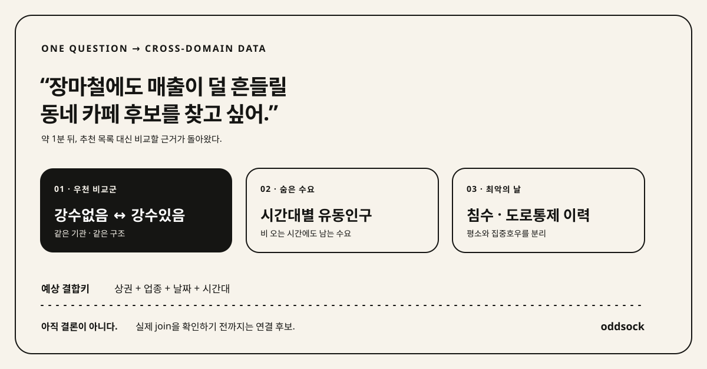

<!-- brand:start -->
<p align="center">
  
</p>

<h1 align="center">oddsock</h1>

<p align="center"><em>말은 없다. 흩어진 맥락을 잇는다. 데이터의 짝을 찾아온다.</em></p>
<p align="center">답이 되는 데이터는 한 분야에만 있지 않았다.</p>
<!-- brand:end -->

<p align="center">
  
  <a href="LICENSE"></a>
</p>

<p align="center">
  <strong>데이터 96,000+개 &middot; 실계정 E2E 4종 &middot; provider canary 11개</strong><br>
  <sub>REST·LINK·FILE을 함께 찾고, 실제 명세와 파일을 검사해, 활용신청부터 첫 호출까지 잇는다.</sub>
</p>

---

회사 살림을 20년간 맡아 온 베테랑은 사라진 영수증을 영수증철에서만 찾지 않는다. 누가 마지막으로
썼는지, 어느 회의에 들고 갔는지, 평소 어떤 서류와 함께 묶어 두는지까지 기억한다. 잠시 뒤,
전혀 다른 서류철에서 찾아온다.

데이터를 연결하는 일도 똑같다. 답의 나머지 한 짝은 같은 분야가 아니라 전혀 다른 기관이나 주제 아래
있을 수 있다.

**oddsock은 당신의 AI 에이전트 안에서 그런 베테랑처럼 일한다.**

## 기존 도구는 어디에서 멈췄나

포털 자체와 타 포털 전용 구현을 제외한 data.go.kr 관련 공개 도구 10개를 README 문구가 아니라 실제
도구 등록과 호출 코드로 비교했다. 검색→상세→호출을 이미 지원하는 도구도 있었다. 하지만 활용신청
제출과 승인 확인까지 처리한 구현은 10개 중 0개였다. 데이터가 여러 분야에 걸치면 사람은 포털로 돌아가
이 구간을 데이터마다 반복해야 했다.

<p align="center">
  
</p>

oddsock의 차이는 검색이나 호출을 처음 만들었다는 데 있지 않다. **다른 분야에 흩어진 데이터를 한
질문의 후보로 모으고, 기존 도구가 사람에게 돌려보내던 구간까지 이어 간다.** data.go.kr REST라면
사람은 정부 SSO에 한 번 로그인하고, 이후 에이전트가 발견→검사→신청→승인 확인→호출을 계속한다.

비교 대상·고정 커밋·판정 근거와 한계는
[공공데이터 MCP·CLI 경쟁 워크플로 감사](docs/research/competitive-workflow-audit.md)에 남겼다.

가게 하나를 열기 전에 알고 싶은 것은 사람이 늘고 있는지, 비슷한 가게는 얼마나 버티는지, 평일 낮과
주말 밤 중 언제 돈이 쓰이는지다. 생활인구는 사람의 흐름을, 매출은 소비를, 점포와 폐업 이력은 경쟁과
생존을 보여준다. 어느 하나도 혼자서는 질문에 답하지 못한다. 실제 질문은 분야를 가로지르는데,
공공데이터는 기관과 주제별로 나뉘어 있기 때문이다.

공공데이터포털에서 `사람이 늘어나는 동네`를 검색해도 답은 잘 나오지 않는다. 포털이 알아듣는 말은
`생활인구`, `추정매출`, `점포이력`, `상권변화지표`다. 필요한 데이터의 이름을 알아낸 뒤에도 서로 다른
분야의 조각을 찾아 한 질문에 맞게 다시 모아야 한다.

## 질문은 하나인데, 답은 한 분야에 있지 않다

이 질문에 답하고 싶다고 해보자.

> 서울에서 작은 가게를 열고 싶어. 사람들이 늘기 시작한 동네와 덜 붐비는 업종을 검토할 자료를 찾아줘.

### 직접 찾으면

`뜨는 동네`, `장사 잘되는 곳`, `경쟁 적은 업종`을 검색한다. 블로그와 부동산 기사는 나오지만 바로
비교할 데이터는 나오지 않는다. 공공데이터포털에서는 생활인구·매출·점포·개폐업·공실을 따로 검색하고,
상세페이지마다 CSV와 XLS를 내려받는다. API라면 활용신청서를 쓰고 승인과 키를 기다린다.

한참 뒤에도 손에 남는 건 서로 기준이 다른 파일과 링크다. 정말 기회가 없는 건지, 검색어를 잘못
고른 건지, 아직 필요한 데이터를 못 찾은 건지 알기 어렵다.

### oddsock이라면

```text
"서울에서 작은 가게를 열고 싶어. 사람들이 늘기 시작한 동네와 덜 붐비는 업종을 검토할 자료를 찾아줘."

catalog_search → inspect_dataset ─┬─ FILE: 실제 파일과 컬럼 관찰
                                  ├─ REST: (apply) → call_api
                                  └─ LINK: 검증된 adapter 또는 공식 경로 안내
```

AI는 한 문장을 생활인구·업종별 매출·점포 생존·개폐업처럼 서로 다른 분야가 맡을 질문으로 나눈다.
oddsock은 약 9.6만 개의 API·파일·외부 링크에서 각 질문에 맞는 후보와 함께 볼 짝을 찾는다. 에이전트는
고른 후보의 실제 명세와 파일 컬럼을 검사한다. REST라면 필요할 때 활용신청을 내고 인증키를 보여주지
않은 채 호출하며, FILE은 내려받아 구조를 관찰한다. 지원하지 않는 외부 제공기관은 공식 경로를
알려주고 멈춘다.

질문은 가게 하나였다. 답의 조각은 인구·상권·사업체처럼 서로 다른 분야와 기관에 있었다. oddsock은
혼자서는 반쪽인 데이터를 나란히 놓고, 어디까지 연결해 확인할 수 있는지 보여준다.

oddsock이 성공할 가게를 대신 골라주지는 않는다. 대신 감으로 끝나던 사업 아이디어를 어떤 데이터로
검증할 수 있는지 보여주고, 그 데이터를 실제로 쓸 수 있는 곳까지 데려온다.

## 먼저 로그인 없이, 그다음 한 문장

데이터포털 계정도 API 키도 필요 없다. 릴리스에 검증된 전체 카탈로그가 함께 들어 있으므로 설치하자마자
로컬에서 검색할 수 있다.

```sh
curl -fsSL https://github.com/JungHoonGhae/oddsock/releases/download/v0.16.1/install.sh | sh

oddsock catalog search \
  "서울에서 작은 가게 후보를 좁힐 자료" \
  --concept 생활인구 \
  --concept 추정매출 \
  --concept "상권 점포" \
  --concept "상권 개폐업" \
  --limit 8 --semantic=false -f table
```

현재 릴리스 카탈로그로 실행하면 서울 생활인구·추정매출뿐 아니라 서울의 점포 데이터와 대전의
상권별 개폐업 데이터까지 한 번에 나타난다. 여기까지는 로그인도, 외부 AI 호출도, 파일 다운로드도 없다.

위 예시는 결과를 누구나 그대로 재현하기 위한 lexical 경로다. 의미 유사도까지 반드시 포함해야 하는
조사라면 로컬 Ollama 인덱스를 만든 뒤 strict mode를 사용한다.

```sh
oddsock catalog semantic-build
oddsock catalog search \
  "제주 성인 실종 신고와 담당 인력 구조를 최대한 정확하게 검토할 데이터" \
  --require-semantic -f json
```

일반 검색에서도 `semantic.status`와 `warnings`에 실제 사용 여부가 남는다. `--require-semantic`은
`status=used`가 아니면 lexical 결과를 출력하지 않고 실패하므로, 인덱스 불일치나 Ollama 장애를
조용히 넘길 수 없다.

그다음 `inspect <PK> --observe`로 실제 파일과 컬럼을 확인한다. REST 활용신청과 첫 호출까지 가고 싶을
때만 `oddsock login`으로 data.go.kr에 한 번 로그인한다.

검색축을 직접 적는 대신 질문 하나만 던질 수도 있다. 설치되어 로그인된 Codex·Claude·Gemini·Cursor 중
하나가 검색 계획을 만들므로, 이 명령의 질문은 선택된 AI 제공자에게 전송된다.

```sh
oddsock catalog discover \
  "장마철에도 매출이 덜 흔들릴 동네 카페 후보를 찾고 싶어. 어떤 데이터를 같이 봐야 하는지 찾아줘." \
  --connections --limit 12 --semantic=false -f table
```

2026-09-03 Codex 계획기로 실행한 결과, 서대문구의 `강수없음` 자료를 Anchor로 잡고 같은 기관의
`강수있음` 자료, 시간대별 유동인구, 침수 기록을 Bridge 후보로 꺼냈다. 예상 결합키도
`상권 + 업종 + 날짜 + 시간대`처럼 함께 보여줬다.

여기서 바로 “비 오는 날 잘되는 카페”라고 결론 내리지는 않았다. 실제 파일의 키·match rate·cardinality를
확인하기 전까지는 **연결 후보**라고 표시했다. 넓게 찾되, 확인하지 않은 주장은 좁게 멈춘다.

<p align="center">
  
</p>
<p align="center">
  <sub>v0.16.0 · 2026-09-03 · <code>catalog discover --connections</code> · data.go.kr 로그인·API 키·Ollama 없이 실행 · <a href="docs/research/launch-readiness-linkedin-geeknews-2026-09.md">실행 조건과 후보 PK</a></sub>
</p>

## Numbers

그럴듯한 데모 대신 실제 계정과 실제 포털에서 확인했다.

| 확인한 것 | 결과 |
| --- | --- |
| 통합 카탈로그 | 2026-09-02 릴리스 기준 96,683개 노드. REST·LINK·FILE과 복수 제공형 보존 |
| 실계정 end-to-end | 온비드 공매·나라장터 입찰·공영도매시장 경매·중소기업 지원사업 데이터 4종의 활용신청→승인→호출 |
| 외부 제공기관 | SafetyKorea·FoodSafetyKorea·VWorld typed 호출, 서울 열린데이터광장 계약 검사 |
| drift 감시 | provider adapter 4개, live canary 11개, 주간 CI |
| 실패 경계 | 미지원 LINK·불안전한 전송·불충분한 결합 근거에서 멈춤 |

검색→상세→호출 MCP 자체는 이미 있다. oddsock은 그걸 처음 만들었다고 말하지 않는다. 차이는 그
앞뒤다. **정확한 데이터 이름을 모르는 상태에서 여러 분야의 후보를 찾고, 파일을 실제로 열어 보고,
활용신청과 키 관리까지 첫 호출로 잇는다.**

비교 방법과 근거는 [경쟁 워크플로 조사](docs/research/competitive-workflow-audit.md)에 있다.

## 검색보다 귀찮은 것

공공데이터포털에서 API 하나를 처음 부를 때 사람이 하던 일:

| 사람이 하던 일 | oddsock |
| --- | --- |
| 포털이 알아듣는 검색어 추측 | 자연어 목표를 3~8개의 검색축으로 나눔 |
| 상세페이지를 돌며 API·FILE·LINK 판별 | 실제 명세·다운로드 자산·컬럼 검사 |
| 활용목적 작성, 기능 선택, 신청 제출 | `apply`가 포털의 실제 신청 폼 제출 |
| 승인 상태 재확인 | 승인 결과와 심의 유형 확인 |
| serviceKey 복사 | 모델에 노출하지 않고 계정 키 주입 |
| XML 파싱과 엔드포인트별 호출 코드 작성 | `call_api`가 `pk`로 호출하고 JSON 반환 |

data.go.kr REST라면 사람은 정부 SSO에 한 번 로그인한다. 그다음 검색 → 검사 → 활용신청 → 승인 확인 →
키 획득 → 첫 호출은 CLI나 MCP 에이전트가 잇는다. LINK는 제공기관마다 별도 신청과 키가 필요할 수 있다.

자동승인이 곧바로 호출 가능하다는 뜻도 아니다. 게이트웨이 반영에는 실측으로 보통 7~10분이 걸렸다.
`call --wait 10m`은 키를 바꾸거나 다시 신청하는 대신 가만히 기다린다. 생각보다 드문 기능이다.

## How it works

oddsock은 검색 1위를 정답이라고 부르지 않는다. 다음 단계를 차례로 밟는다.

```text
1. 무슨 데이터가 필요한가?     → 질문을 서로 다른 역할의 검색축으로 나눈다
2. 이름이 틀렸을 수 있나?       → 96,000+개 통합 카탈로그를 함께 뒤진다
3. 정말 쓸 수 있나?             → API 명세와 FILE의 실제 컬럼을 본다
4. 권한이 필요한가?              → 활용신청·승인·provider 키를 처리한다
5. 서로 연결되는가?              → 필드·범위·값 교집합을 확인한다
6. 근거가 부족한가?              → 억지로 엮지 않고 abstention한다
```

탐색은 넓게 한다. 주장은 좁게 한다.

자연어 검색은 데이터를 발견하는 장치이지, 상관관계나 인과관계를 자동으로 증명하는 장치가 아니다.
전체 계약은 [교차 데이터 연결 발견 명세](docs/specs/cross-domain-connection-discovery-v1.md), 실제 평가는
[연결 발견 평가](docs/research/connection-discovery-evaluation.md)에 있다.

구성요소, 데이터 흐름, 로컬 상태와 신뢰 경계는 [아키텍처 문서](ARCHITECTURE.md)에 정리했다.

## Install

macOS / Linux:

```sh
curl -fsSL https://github.com/JungHoonGhae/oddsock/releases/download/v0.16.1/install.sh | sh
```

Windows:

```powershell
irm https://github.com/JungHoonGhae/oddsock/releases/download/v0.16.1/install.ps1 | iex
```

설치 스크립트는 바이너리와 같은 릴리스의 checksum을 검증하고, 검증된 카탈로그 snapshot도 함께
설치한다. 또는 Go 1.26.6 이상이 있다면:

```sh
go install github.com/JungHoonGhae/oddsock/cmd/oddsock@latest
oddsock catalog sync
```

소스 설치에는 릴리스의 prebuilt 카탈로그가 포함되지 않으므로 첫 검색 전에 한 번 동기화한다.

### AI 에이전트에 연결

```sh
codex mcp add oddsock -- oddsock mcp
claude mcp add oddsock -- oddsock mcp
gemini mcp add --scope user oddsock oddsock mcp
```

Cursor·Claude Desktop처럼 JSON 설정을 쓰는 호스트:

```json
{
  "mcpServers": {
    "oddsock": {
      "command": "oddsock",
      "args": ["mcp"]
    }
  }
}
```

Codex CLI·IDE·ChatGPT 데스크톱은 같은 Codex 호스트의 MCP 설정을 공유한다. 등록 뒤에는 새 세션을
열거나 클라이언트를 재시작하고 `/mcp` 또는 `codex mcp list`에서 `oddsock`이 enabled인지 확인한다.
oddsock은 초기화할 때 도구 선택 지침도 함께 제공한다. 사용자가 “최대한 정확하게”, “시맨틱”,
연구·감사·안전 조사를 요청하면 호스트가 `catalog_search(requireSemantic=true)`를 사용하며,
의미 검색 실패 시 `semantic=false`로 몰래 재시도하지 않도록 계약되어 있다.

이제 데이터 이름 대신 궁금한 것을 말하면 된다.

```text
서울에서 새 가게 후보를 좁힐 생활인구·매출·점포·폐업 자료를 함께 찾아줘.
식재료 원가 변화를 검토할 가격·반입량·작황 자료를 함께 찾아줘.
빈집과 방문객 변화로 지역 사업을 검토할 인구이동·관광·소비 자료를 찾아줘.
```

## CLI

```sh
# 브라우저가 한 번 열린다. data.go.kr에 로그인한다.
oddsock login

# 정확한 데이터 이름을 몰라도 된다.
oddsock catalog discover "지역 소멸로 생길 사업 기회"

# API 명세 또는 FILE의 실제 자산·컬럼을 확인한다.
oddsock inspect <PK> --observe

# API가 필요하면 활용신청한다. CLI는 제출 전 y/N을 묻는다.
oddsock apply <PK> --purpose "지역 사업 기회 분석" --category research

# 엔드포인트와 serviceKey를 직접 다루지 않고 호출한다.
oddsock call --pk <PK> --param numOfRows=5
```

## 다 같은 데이터가 아니다

| 유형 | oddsock이 하는 일 |
| --- | --- |
| `REST` | 포털의 공식 operation과 필수 파라미터를 확인하고 신청·호출 |
| `LINK` | SafetyKorea·FoodSafetyKorea·VWorld 등 검증된 adapter만 typed 호출 |
| `FILE` | 다운로드 링크만 보여주지 않고 CSV·DBF·XLSX의 작은 표본과 실제 스키마를 관찰 |

API처럼 보이는 링크라고 엔드포인트를 지어내지 않는다. 파일이라고 사람에게 다운로드를 떠넘기지도 않는다.
검증된 계약이 없는 제공기관은 공식 경로를 알려 주고 멈춘다.

## 마법은 아니다

- 정부 SSO 로그인과 심의승인을 우회하지 않는다.
- 모든 LINK 제공기관을 하나의 키로 부르지 않는다.
- 연결 후보는 실제 필드·범위·값 교집합을 확인하기 전까지 후보다.
- 활용신청 자동화는 포털 HTML에 의존한다. 포털이 바뀌면 깨질 수 있고, `oddsock doctor`와 canary가 이를 감시한다.
- data.go.kr 밖의 이용조건은 각 제공기관 정책을 따른다.

## Security

`oddsock login`은 로그인이 끝나면 브라우저를 닫고 세션을 운영체제의 사용자 설정 디렉터리에 저장한다.
인증키는 MCP 입력·출력이나 로그에 내보내지 않고 호출 직전에만 넣는다. `oddsock logout`은 세션,
data.go.kr 키, provider 키와 Chrome 프로파일을 지운다.

세션과 키는 파일 권한으로 접근을 막지만 암호화되지는 않는다. 공용 머신에서는 쓰지 않는 편이 좋다.
MCP의 `apply`는 확인 대화 없이 실제 활용신청을 만들 수 있다. 직접 확인하고 싶다면 제출 전 `y/N`을
묻는 CLI를 쓰면 된다.

MCP에서는 호스트 AI가 검색축을 만들고 `catalog_search`에 구조화해 넘긴다. 반면 독립 CLI의
`catalog discover`는 설치되어 로그인된 Codex·Claude·Gemini·Cursor 중 하나를 별도 프로세스로 실행해
입력한 자연어 목표를 stdin으로 전달한다. oddsock은 그 로그인 토큰을 읽거나 저장하지 않지만, 목표는
선택된 AI 제공자에게 전송되므로 미공개 사업계획·개인정보 같은 민감한 내용은 넣지 않는다. 검색 뒤의
카탈로그 문장은 untrusted data로 표시하고 Codex·Claude·Gemini의 도구를 끈다. no-tools 격리가 없는
Cursor는 초기 검색 계획에만 쓰며 실제 카탈로그 metadata를 보내지 않는다.

보안 경계와 남는 위험은 [ADR](docs/adr/)과 [provider adapter guide](docs/provider-adapters.md)에 있다.

## 이전 이름

`opendatactl`과 `gongctl`은 전환 기간 동안 같은 엔진을 실행한다. 기존 설정·로그인 세션·인증키도
복사 없이 다시 찾는다. 새 자동화에는 `oddsock` 명령과 `oddsock://guide` MCP 리소스를 쓰면 된다.

이전 공개 Homebrew cask는 더 이상 갱신되지 않는다. v0.12.0 이상은 위의 설치 스크립트를 사용한다.
파일로 저장해 둔 v0.8 Windows 설치 스크립트도 저장소 이름 변경을 따라가지 못하므로, 위의 최신
PowerShell 명령을 한 번 실행해 기존 설치 폴더의 `oddsock.exe`,
`opendatactl.exe`, `gongctl.exe`를 함께 갱신한다. 설정과 로그인 상태는 그대로 유지된다.

## Development

새 provider adapter, 재현 가능한 교차 데이터 질문, 실패 사례를 환영한다. adapter는 공식 문서,
고정된 credential scope, contract test와 canary가 있어야 호출 가능 상태가 된다.

```sh
go test ./...
go vet ./...
go build ./...
```

전체 구조는 [아키텍처 문서](ARCHITECTURE.md), 구현 규칙은
[provider adapter guide](docs/provider-adapters.md), 설계 결정은 [ADR](docs/adr/)에서 시작한다.
처음 기여한다면 [기여 가이드](CONTRIBUTING.md)를, 보안 문제라면 공개 이슈를 만들기 전에
[보안 정책](SECURITY.md)을 먼저 읽는다.
사용법 질문과 재현 가능한 공개데이터 질문은 [Discussions](https://github.com/JungHoonGhae/oddsock/discussions)에
남길 수 있다.

공개 이름·문구·로고 경로는 [`docs/brand/brand.json`](docs/brand/brand.json)이 기준이다. 값을 바꾼 뒤
`go run ./scripts/sync-brand.go`를 실행하면 위 브랜드 블록이 갱신되고, CI는 `--check`로 동기화를 확인한다.

## License

[MIT](LICENSE). 데이터의 짝을 찾는 데 가장 짧은 라이선스.
