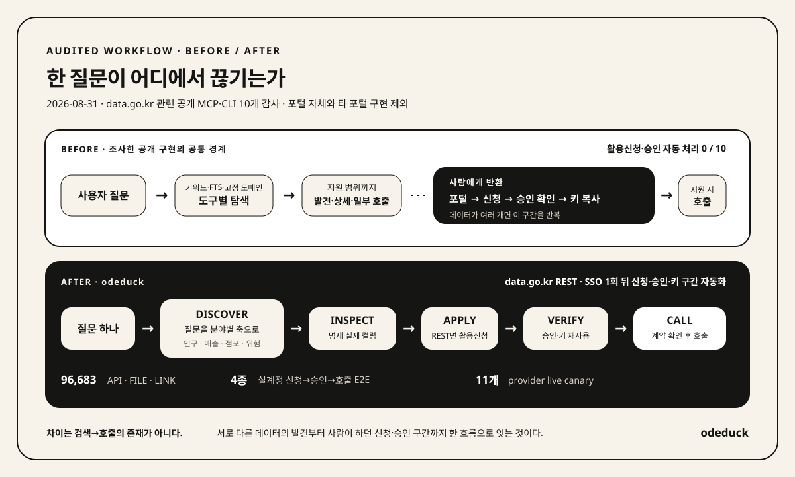

<!-- brand:start -->
<p align="center">
  
</p>

<h1 align="center">오데덕</h1>

<p align="center"><em>오픈데이터 덕후, 오데덕.</em></p>
<p align="center">질문에서 서로 먼 데이터를 찾고, 활용신청부터 호출까지 잇는 CLI + MCP입니다.</p>
<!-- brand:end -->

<!-- Keep the introduction animation visible. Core capabilities and architecture must also remain visible, not collapsed. -->
<p align="center">
  <a href="docs/assets/odeduck-hero.mp4"></a>
</p>
<p align="center">
  <sub>서로 상관없어 보이는 조각도, 함께 보면 질문의 나머지가 된다. · <a href="docs/assets/odeduck-hero.mp4">원본 영상</a></sub>
</p>

<p align="center">
  
  <a href="LICENSE"></a>
</p>

<p align="center">
  <strong>데이터 96,000+개 &middot; 실계정 신청·호출 4종 &middot; 제공기관 canary 11개</strong><br>
  <sub>data.go.kr의 API·파일·외부 링크를 함께 탐색하고, 활용신청부터 첫 호출까지 잇는다.</sub>
</p>

---

**키워드를 몰라도 질문에서 시작합니다.** 서로 다른 분야의 데이터를 찾고, 필요한 API의 활용신청부터 첫 호출까지 잇습니다.

[핵심 기능](#탐색부터-신청호출까지) · [빠른 시작](#빠른-시작) · [전체 아키텍처](#전체-아키텍처) · [지원 범위](#지금-쓸-수-있는-범위) · [검증 결과](#확인한-결과와-남은-검증)

## 탐색부터 신청·호출까지


사람은 `odeduck login`으로 정부 SSO 로그인을 한 번 마친다. 이후 MCP 에이전트가 **활용신청 제출 → 승인 확인 → 계정 키 재사용 → 실제 호출**을 이어 간다. 인증키를 직접 복사해 모델에 전달할 필요가 없다.

자동 신청은 **data.go.kr REST**가 대상이며 MCP host의 도구 승인 정책을 따른다. 심의형 API는 기관 승인을 기다린다.
외부 제공기관은 검증된 adapter와 별도 키를 사용한다. 아래 실험적 `solve`는 자동 활용신청을 하지 않는다.

## 빠른 시작

**설치 → 첫 검색 → 에이전트 등록 → 질문**, 네 단계다. 명령 입력과 설정은 약 3분이며 다운로드 대기 시간은 환경에 따라 달라진다.
이미 설치했다면 [2번 첫 검색](#2-첫-검색-실행하기)부터 시작한다.

### 1. 설치하기

릴리스에는 검증된 카탈로그가 포함되어 있다. **첫 검색에는 로그인·API 키·AI 호출이 필요 없다.**

macOS·Linux:

```sh
curl -fsSL https://github.com/JungHoonGhae/odeduck/releases/download/v0.19.0/install.sh | sh
```

<details>
<summary>Windows 설치 명령</summary>

```powershell
irm https://github.com/JungHoonGhae/odeduck/releases/download/v0.19.0/install.ps1 | iex
```

</details>

### 2. 첫 검색 실행하기

아래 명령을 그대로 실행한다. data.go.kr 로그인·API 키·AI 호출이 필요 없다.

```sh
odeduck catalog search "건축물" --limit 5 --semantic=false -f table
```

**데이터 목록이 나오면 첫 검색 성공이다.** 다른 자료를 찾으려면 `건축물`만 원하는 검색어로 바꾼다.

키워드를 직접 정하기 어렵다면 다음 단계에서 에이전트에 목표를 말한다.

<details>
<summary>Go 소스 설치와 카탈로그 동기화</summary>

Go 1.26.6 이상:

```sh
go install github.com/JungHoonGhae/odeduck/cmd/odeduck@latest
odeduck catalog sync
```

릴리스 설치기는 checksum을 검증하고 같은 릴리스의 카탈로그 스냅샷을 설치한다.
소스 설치에는 이 prebuilt 카탈로그가 포함되지 않으므로 첫 검색 전에 한 번 동기화한다.
전체 동기화의 웹 보강은 수십 분 걸릴 수 있다. 빠른 월간 CSV 목록만 필요하면
`odeduck catalog sync --source official-file`을 사용한다. 이 빠른 목록에는 일부 API·FILE 복수
제공형이 빠질 수 있으므로, 완전한 제공형 탐색에는 릴리스 카탈로그를 권장한다.

</details>

### 3. 에이전트에 등록하기

Codex를 사용한다면 아래 명령 하나로 등록한다.

```sh
codex mcp add odeduck -- odeduck mcp
```

<details>
<summary>Claude·Gemini 등록 명령</summary>

사용하는 에이전트의 명령 하나만 실행한다.

```sh
# Claude
claude mcp add odeduck -- odeduck mcp

# Gemini
gemini mcp add --scope user odeduck odeduck mcp
```

</details>

<details>
<summary>Cursor·Claude Desktop 등 JSON 설정</summary>

```json
{
  "mcpServers": {
    "odeduck": {
      "command": "odeduck",
      "args": ["mcp"]
    }
  }
}
```

</details>

`/mcp` 또는 `codex mcp list`에서 **`odeduck` 등록을 확인하면 설정 완료다.**

### 4. 목표 말하기

에이전트에서 새 대화를 연다. 등록이 반영되지 않았다면 클라이언트를 재시작한다.
아래 질문을 붙여 넣는다.

> 장마철에도 매출이 덜 흔들릴 동네 카페 후보를 찾고 싶어. 어떤 데이터를 같이 봐야 하는지 찾아줘.

이 단계에서 확인할 것은 **데이터 후보와 출처**다. 에이전트가 검색어를 정해 후보를 찾고 실제
명세와 파일을 검사한다. 결과를 연결·계산하는 기능은 [실험적 목표 실행](#목표에서-결과까지-실행하기--experimental)에서 확인한다.

## 활용신청과 첫 호출

MCP에서는 에이전트가 검사 결과에 따라 `apply`와 `call_api`를 이어 간다. 직접 실행하려면 아래 CLI 명령을 사용한다.
고른 데이터의 `PK`는 검색 결과에서 확인한다.

```sh
odeduck inspect <PK> --observe

# 활용신청·인증 호출이 필요할 때 data.go.kr에 한 번 로그인한다.
odeduck login

# 신청이 필요한 API만 실행한다. CLI는 제출 전 y/N을 묻는다.
odeduck apply <PK> --purpose "공공데이터 비교 분석" --category research

# 검사 결과에 맞는 operation과 필수 파라미터를 사용한다.
odeduck call --pk <PK> --op <OPERATION> --param <NAME>=<VALUE>
```

`call`은 인증키를 내부에서 넣는다. 자동승인 후 게이트웨이 반영이 늦으면 `--wait 10m`으로
새 키 발급이나 재신청 없이 기다릴 수 있다.

| 제공형 | 취득 방식 |
| --- | --- |
| `REST` | 포털의 공식 operation·필수 파라미터·승인 상태를 확인해 호출 |
| `LINK` | SafetyKorea·FoodSafetyKorea·VWorld 등 검증된 adapter로 호출. 미지원 기관은 공식 경로 안내 |
| `FILE` | 지원되는 다운로드 자산에서 CSV·SHP의 DBF·XLSX 컬럼과 제한된 표본을 관찰 |


## 전체 아키텍처


CLI와 MCP는 **같은 Go 백엔드**를 사용한다. 탐색은 카탈로그의 키워드·선택형 의미 검색을 조합하며,
실제 계약 검사·신청·인증키 처리·호출은 공통 모듈이 맡는다. 파일·표준데이터 관찰은 API 신청 경로와 분리된다.

[모듈별 책임과 실행 흐름](ARCHITECTURE.md) · [도메인 용어](CONTEXT.md)

## 지금 쓸 수 있는 범위

| 범위 | 현재 상태 |
| --- | --- |
| 데이터 탐색·검사 | 약 9.6만 건의 카탈로그에서 API·FILE·LINK를 함께 검색. API 계약과 지원되는 파일의 실제 컬럼 확인 |
| 활용신청·호출 | data.go.kr 로그인 한 번 뒤 신청·승인 확인·계정 키 재사용·호출. 외부 제공기관은 검증된 adapter와 별도 키 사용 |
| 목표 기반 분석 | v0.19.0의 실험적 `solve`·MCP `advance_goal`. 원천 조회, 제한된 연결·계산, 추가 탐색과 결과 검토 |
| 전체 목표 완주 | 미완료. 분야 간 자율 완주, 일반적인 공간·인과·사업 가설 검증, 프로세스 재개와 장기 근거 재사용은 남은 과제 |

후보 발견, 표본 계산, 질문 전체에 대한 답은 서로 다른 단계다. 가능한 질문에서 실제 산출물에 도달하는 것과
잘못된 연결을 거르는 것을 함께 검증한다. 요구사항별 상태는
[목표 실행·검증 계획](docs/specs/goal-driven-completion-plan.md)에서 확인할 수 있다.

<details>
<summary>어떤 질문에 쓰는 도구인가요? — 사용 예시와 제품 목표</summary>

### 키워드를 몰라도, 질문에서 시작한다

“어떤 데이터를 찾아야 하지?”가 첫 번째 벽인 사람이 있다. 필요한 자료의 이름을 알아도
인구·교통·시설처럼 서로 다른 분야에 흩어져 있으면 한 질문에 함께 쓰기 어렵다.

오데덕은 data.go.kr의 API·파일·외부 링크를 함께 찾고 실제 명세와 파일을 검사한다.
필요한 API의 활용신청·승인 확인·인증키 사용·호출도 이어 준다. CLI와 MCP는 같은 기능을 사용한다.

**오데덕이 이루려는 목표는 서로 먼 데이터를 연결해, 사용자가 원하는 결과와 그 근거까지 얻는 것이다.**
비교표나 계산 결과에는 사용한 원천과 기준 시점이 따라야 한다. 가설에는 가정과 확인할 점이 남아야 한다.
처음 찾은 자료로 답하기 어렵다면 다른 원천이나 중간 대응표를 찾아 같은 질문을 계속 풀어간다.

현재는 검색·검사·신청·호출을 제공하며 목표 기반 연결·분석은 실험 단계다.
구현 방향과 완료 기준은 [INTENT.md](INTENT.md)에 있다.

### 질문은 하나인데, 필요한 데이터는 여러 곳에 있다

아래는 오데덕이 완성하려는 사용 예시다. 각 질문의 전체 자동 실행을 검증한 성공 사례는 아니다.

| 이루려는 일 | 함께 살펴볼 데이터의 역할 | 기대하는 산출물 |
| --- | --- | --- |
| 동네 가게 후보를 비교하고 싶다 | 생활인구·업종별 매출·점포 변화·교통 접근성 | 같은 지역·기간으로 비교한 표와 추가 확인 사항 |
| 폭염 때 어르신이 쉴 곳을 검토하고 싶다 | 고령 인구·쉼터 위치와 운영정보·주변 교통 | 지역별 비교와 현장 확인이 필요한 항목 |
| 식재료 원가가 왜 달라졌는지 검토하고 싶다 | 가격·반입량·작황·기상 | 시점별 비교와 원인을 설명할 가설·반증 자료 |

함께 볼 자료는 질문과 실제 관측에 따라 달라진다. 이름이 같은 지역도 서로 다른 곳일 수 있다.
지번별 사용량은 건물 하나의 사용량과 다를 수 있다. 식별자·기간·관측 단위가 맞는지 확인해야
그 데이터로 무엇을 말할 수 있는지 정할 수 있다.

결과에는 무엇을 연결했는지, 어떤 계산을 했는지, 무엇이 빠졌는지가 남아야 한다.
한 자료만으로 충분한 질문에는 그 자료를 조회·집계한다.

</details>

## CLI에서 목표로 탐색하기

검색어를 직접 정하기 어려우면 `catalog discover`에 질문을 전달한다. 설치·로그인된
Codex·Claude·Gemini·Cursor 중 하나가 검색 계획을 만든다.

```sh
odeduck catalog discover \
  "장마철에도 매출이 덜 흔들릴 동네 카페 후보를 찾고 싶어. 어떤 데이터를 같이 봐야 하는지 찾아줘." \
  --connections --limit 12 --semantic=false -f table
```

<details>
<summary>실제 검색 예시: 강수·유동인구·침수 기록을 함께 찾은 결과</summary>

아래는 실제 실행에서 찾은 연결 후보다. 강수 비교군·유동인구·침수 기록을 함께 제시했고
예상 결합키와 검증 전 한계를 남겼다. 매출 안정성이나 실제 데이터 결합을 입증한 결과는 아니다.

<p align="center">
  
</p>
<p align="center">
  <sub>v0.16.0 · 2026-09-03 · <code>catalog discover --connections</code> · data.go.kr 로그인·API 키·Ollama 없이 실행 · <a href="docs/research/launch-readiness-linkedin-geeknews-2026-09.md">실행 조건과 후보 PK</a></sub>
</p>

</details>

`--semantic=false`는 Ollama 없이 실행하는 검색이다. 의미 검색을 함께 쓰려면 로컬 Ollama를
실행한 상태에서 `odeduck catalog semantic-build`로 인덱스를 만든다. 이후 `--semantic=false`를 빼면 된다.
의미 검색이 반드시 필요한 조사에는 `--require-semantic`을 사용한다. 인덱스나 Ollama에 문제가 있으면
일반 검색으로 조용히 대체하지 않고 실패한다.

## 목표에서 결과까지 실행하기 — experimental

v0.19.0의 `solve`는 목표를 역할·범위·필수 출력으로 나누고 검색·검사·취득·연결·계산을 반복한다.
결과와 근거를 검토하다 빠진 자료가 드러나면 같은 목표와 예산 안에서 대안을 찾는다.
MCP에서는 `advance_goal`로 host가 같은 실행기를 진행한다.


지원하는 연산과 허용된 검토 안에서의 실행 흐름이다. 분야 간 자율 완주를 검증한 성공 사례를 뜻하지 않는다.
[다이어그램 원본](docs/assets/odeduck-goal-flow.html)

설치·로그인된 Codex·Claude·Gemini 중 하나와 로컬 Ollama가 필요하다. Cursor는 `solve`의 계획기로
지원하지 않는다. 아래 명령은 실험 기능을 실행하는 예시이며 목표 완주를 보장하지 않는다.

```sh
odeduck catalog semantic-build
odeduck solve "폭염 때 어르신이 쉴 곳을 찾는 데 도움이 될 데이터를 서로 연결해줘"
```

**실행 뒤에는 JSON의 결과·근거·미완료 사유를 확인한다.** 결과가 만들어져도 질문 전체가 해결됐다는 뜻은 아니다.

- **실행 한도:** 기본 32단계. agent CLI의 비용·호출 한도가 적용된다.
- **취득 조건:** 의미 검색이 실제로 쓰이지 않으면 기본적으로 멈춘다. 자동 활용신청은 하지 않는다.
- **계산 범위:** API·CSV·ZIP 내부 CSV·XLSX·포털 STD의 제한된 표본을 조회·연결·집계한다.
- **완료 조건:** 필수 출력과 지역·식별자·기간의 의미가 충족돼야 한다. 필요한 검토가 끝나지 않으면 미완료로 반환하고 CLI는 실패 코드로 종료한다.

원천 값 공유와 별도 모델 검토는 **기본으로 꺼져 있다.** 완료 검토를 사용하려면 아래 설정을 명시적으로 켜야 한다.
이는 모델 검토이며 현장·사람 검증을 뜻하지 않는다.

<details>
<summary>원천 공유와 별도 모델 검토 설정</summary>

외부 CLI 계획기에는 기본적으로 원천 값을 보내지 않는다. 선택한 행·필드를 근거로 읽게 하려면
`--agent=claude --share-evidence`처럼 수신 모델 하나를 명시한다. 자동 모델 전환은 허용하지 않는다.
MCP에서는 서버를 `mcp --share-goal-evidence`로 시작해야 하며 모델이 tool 입력으로 켤 수 없다.
세션당 최대 8개/64 KiB의 선택 근거만 허용한다. 개인정보·전송 권한은 사용자가 확인해야 하며,
이 설정은 기존 MCP 실행 결과나 `call_api` 원문 출력을 차단하는 기능이 아니다.

출력 형식이 맞아도 지역·식별자·시간의 의미가 검증되지 않으면 `review_required`로 남기고 같은 목표·예산
안에서 추가 근거와 대안을 찾는다. 제한된 원천 보고는 CLI의 `--review-source-reports`(명시한 agent와
`--share-evidence` 필수), MCP의 `--review-goals-with=claude`와 `--share-goal-evidence`로 별도 검토를
켤 수 있다. typed 관계·계산은 CLI `--review-analyses` 또는 MCP 시작 설정 `--review-goal-analyses`로
추가 허용한다. 원래 질문·출력별 지지와 관계·기간·측정·범위를 통과해야 성공 종료한다. 모델 검토이지
현장·사람 검증은 아니며 공간·인과·사업 가설 및 범용 목표 완주는 미완료다. 결과와 검토는 실행 revision에 묶인다.
[원천 보고 검토의 범위와 공개 정책](docs/specs/goal-source-report-review-v1.md)을 확인할 수 있다.

</details>

<details>
<summary>지원 연산과 원천 추적 범위</summary>

실제 결합은 API·직접 CSV·ZIP 내부 CSV·XLSX 셀 범위·포털 STD의 제한된 표본을 지원한다. 먼저 필수 역할·범위·출력을 고정하고,
빠진 항목이 있으면 부분 결과로 남겨 탐색을 계속한다. 한 원천의 필드 조회·집계도 가능하며 결합은 선택 연산이다.
`sample_executed`는 표본 실행 결과이며, 필수 요구 충족이나 의미 검증과는 별개다.

출처, 요청 조건, 원본 위치와 연결하지 못한 기록을 추적한다. 원천에 적힌 값, 계산 결과, 해석과 가설은 구분한다.
직접 CSV는 선택적으로 전체를 순차 검사하고, 관측한 좌표를 기준으로 전체 일치 레코드의 최근접 후보를
계산할 수 있다. 이 구면 거리는 실제 이동 경로나 현재 접근 가능성을 뜻하지 않는다.
전체 CSV 검사에서는 `sample.whereIn`으로 여러 지역·연령처럼 정확한 값 목록을 함께 고를 수 있다.
파일 전체 검사와 일치 행의 실제 보관, 요청한 집단 전체의 확보는 각각 구분해 보고한다.

검사한 FILE의 등록된 공식 HTML 설명은 `sample`의 `delivery:"document"`로 별도 관측할 수 있다.
선택 공개한 원문만 `composition.support`로 해석 검토에 연결하며 계산 행이나 모집단 증거로 자동
승격하지 않는다. 현재 지원은 행안부 월간 통계 도움말과 등록된 KOSIS 공식 답변이며 임의 URL·PDF는
지원하지 않는다. [보조 문서 읽기 계약](docs/specs/source-document-acquisition-v1.md)에 범위를 명시했다.
[실행 계약과 한계](docs/specs/goal-driven-composition-v1.md)를 확인할 수 있다.

</details>

<details>
<summary>연결 판정을 장부에 남기는 조건</summary>

연결 판정은 MCP의 `record_connection_assessment`로 로컬 장부에 남길 수 있다. 출처·필드·관측 시점·
표본 집계를 보존하며 API 응답 원문이나 인증정보는 저장하지 않는다. `sample_verified`는 같은 MCP
세션의 최근 `call_api` profile 영수증과 일치해야 한다. `solve`·`advance_goal`은 장부에 자동 기록하지 않는다.
저장·판정 조건은 [연결 근거 장부 명세](docs/specs/connection-evidence-ledger-v1.md)에 있다.

</details>

## 확인한 결과와 남은 검증

| 확인한 것 | 근거와 적용 범위 |
| --- | --- |
| 통합 카탈로그 | 2026-09-02 릴리스 기준 96,683개 노드. REST·LINK·FILE과 복수 제공형 보존 |
| 실계정 신청·호출 | 온비드 공매·나라장터 입찰·공영도매시장 경매·중소기업 지원사업 데이터 4종의 활용신청→승인→호출 |
| 외부 제공기관·변경 감시 | SafetyKorea·FoodSafetyKorea·VWorld 호출. 서울 열린데이터광장은 HTTPS 부재로 호출 차단. adapter 4개·canary 11개를 주간 CI로 검사 |
| 원천 보고 검토 | 두 개발 사례의 마지막 12회에서 승인 기대 6회·보류 기대 6회가 일치. 사전 선택한 원천·절차의 검증 |
| 전체 목표 완주 | 미완료. 사전 선택한 원천의 검토 결과를 분야 간 자율 완주의 증거로 사용하지 않음 |

원천 보고 검토의 [전체 시도·실패 기록](docs/research/source-report-review-validation-2026-09-08.md)를
함께 공개했다. 사전 선택한 자료로 얻은 검토 결과와 키워드·PK 없이 목표에 도달하는 능력은 구분한다.
분야 간 자율 완주와 공간·인과·사업 가설의 검증은 아직 끝나지 않았다.

<details>
<summary>기존 공개 도구와 비교한 범위</summary>

data.go.kr 관련 공개 도구 10개를 고정한 소스 revision의 도구 등록과 호출 코드로 비교했다.
검색→상세→호출을 지원하는 도구가 있었다. 조사한 구현에서는 활용신청 제출과 승인 확인을 사람이 맡았다.

<p align="center">
  
</p>

오데덕은 목표 기반 카탈로그 탐색, API·FILE·LINK 검사, 활용신청·승인·키 재사용·실호출을 한 흐름에
묶는다. 이 비교는 범용 목표 완주나 분석 정확도의 우위를 입증하지 않는다.
비교 대상·시점·판정 근거는 [경쟁 워크플로 감사](docs/research/competitive-workflow-audit.md)와
[경쟁·수요 교차 검증](docs/research/competitor-and-demand-cross-validation-2026.md)에 있다.

</details>

## 인증과 데이터 취급

`odeduck login`은 사람이 정부 SSO 로그인을 마치면 쿠키를 저장하고 브라우저를 닫는다.
정부 SSO나 제공기관의 심의승인을 우회하지 않는다. data.go.kr의 계정 키와 외부 provider 키는 구분하며
확인한 호출 범위에서만 사용한다. 인증키는 MCP 입력·출력이나 로그에 내보내지 않는다.

세션과 키는 운영체제의 사용자 설정 디렉터리에 파일 권한으로 보호해 저장하며 암호화되지는 않는다.
`odeduck logout`은 세션, data.go.kr 키, provider 키와 Chrome 프로파일을 지운다.

MCP의 `apply`는 확인 대화 없이 실제 활용신청을 만들 수 있다. 제출 전에 직접 확인하려면
`y/N`을 묻는 CLI를 사용한다. 포털 HTML 변경은 `odeduck doctor`와 실호출 점검으로 감시한다.

`catalog discover`와 `solve`는 자연어 목표를 선택한 AI 제공자에게 전달한다. `discover`는
해당 에이전트의 로그인 토큰을 읽거나 저장하지 않는다. Cursor는 격리된 초기 검색 계획에만 사용하며
실제 카탈로그 메타데이터를 보내지 않는다. 미공개 정보를 목표에 포함하기 전에 전송 범위를 확인해야 한다.

목표 실행기의 선택 근거 공개 설정과 일반 MCP 응답은 별개다. `call_api`의 원문 결과는 MCP host가
받는다. 원천 데이터의 이용조건과 전송 권한은 각 제공기관 정책을 따른다.
자세한 경계는 [ADR](docs/adr/)과 [provider adapter guide](docs/provider-adapters.md)에 있다.

## 개발과 기여

원래 질문, 기대하는 결과, 실제 원천과 실패 지점을 함께 남긴 사례를 환영한다.
목표 실행을 개선할 때는 가능한 질문의 산출물과 잘못된 연결을 차단하는 사례를 함께 검증한다.
새 제공기관 adapter에는 공식 문서, 고정된 인증 범위, 계약 테스트와 실호출 점검이 필요하다.

```sh
go mod tidy -diff
go run ./scripts/sync-brand.go --check
go vet ./...
go test ./...
go build ./...
```

| 문서 | 내용 |
| --- | --- |
| [INTENT.md](INTENT.md) | 사용자 문제, 기대 산출물과 완료 기준 |
| [목표 실행·검증 계획](docs/specs/goal-driven-completion-plan.md) | 요구사항별 구현·실증 상태와 남은 과제 |
| [아키텍처](ARCHITECTURE.md) · [도메인 용어](CONTEXT.md) | 구성요소, 데이터 흐름과 공통 언어 |
| [연결 발견 명세](docs/specs/cross-domain-connection-discovery-v1.md) · [연결 발견 평가](docs/research/connection-discovery-evaluation.md) | 후보 탐색·선택 계약과 실제 검색 결과 |
| [연결 근거 장부](docs/specs/connection-evidence-ledger-v1.md) | 출처·시점·판정의 보존과 재검증 경계 |
| [제공기관 adapter guide](docs/provider-adapters.md) · [ADR](docs/adr/) | 호출 계약과 설계 결정 |

처음 기여한다면 [기여 가이드](CONTRIBUTING.md)를, 보안 문제라면 공개 이슈를 만들기 전에
[보안 정책](SECURITY.md)을 읽는다. 사용법 질문과 재현 가능한 공개데이터 질문은
[Discussions](https://github.com/JungHoonGhae/odeduck/discussions)에 남길 수 있다.

공개 이름·문구·로고 경로는 [`docs/brand/brand.json`](docs/brand/brand.json)이 기준이다.
값을 바꾼 뒤 `go run ./scripts/sync-brand.go`를 실행하면 README 상단이 갱신된다.
CI는 `--check`로 동기화를 확인한다.

## 라이선스

[MIT](LICENSE).
